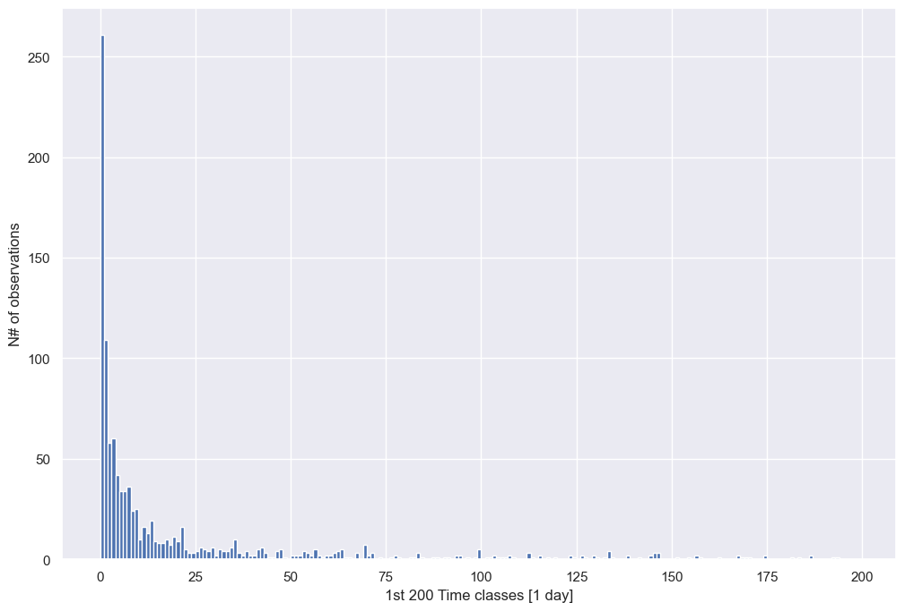
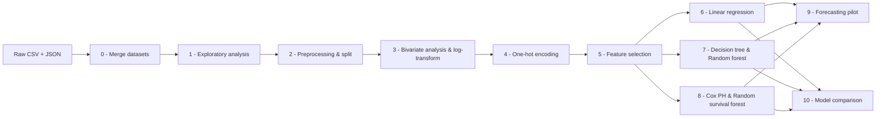

This project is one of my first efforts in the Data Science sphere and I think is worth to share becuase it deals with real-world industry dataset, using the public issue tracker of **Apache Avro**, an open-source data serialisation framework popular in big-data systems.
This document can be used by newcomers in the world of Data Science (DS) to better understand a full machine learning project from bottoms to the top, and also by DS practitioners to read something about an interesting problem of survival analysis with real data, not belonging to the traditional MedTech or HealthCare world.

## The Question

When a developer opens a bug report or feature request, one of the most practical questions is: *how long will this take to fix?* This project tackles exactly that — 

The goal is to build models that can predict **resolution time** using only the information available when a ticket is opened: its type, priority, reporter, a few structural properties extracted from the description, and metadata from the JIRA export.

---

## The Data

The dataset is a snapshot of **1,458 issues** from the Apache Avro JIRA tracker. Not all of them can be used directly for supervised learning: only the **1,134 issues that have already been resolved** give us a ground truth (a real closing time). The remaining **324 still-open issues** have no label and are treated as a *forecasting pilot* — a qualitative check on realistic cases.

The distribution of resolution times tells the whole story immediately: most issues close in a handful of days, but a few linger for months or even years. The longest one in the dataset took nearly **952 days**. This extreme right skew is the single biggest challenge of the project.

---

## Pipeline Overview

The project is structured as a step-by-step Python pipeline, each stage written as a self-contained script.

A single `run_analysis.py` runner executes everything in sequence, but each script can also be run independently since all fitted models are persisted to disk.

---

## Key Engineering Choices

### Taming the skew with a log-transform

Training models directly on resolution times in days would let the few year-long issues dominate the loss function, making predictions useless for the vast majority of tickets. The fix is to train on **log(minutes)** and exponentiate the predictions back to days. This is a standard practice for heavy-tailed targets, and it makes the residuals much better-behaved.

### Avoiding data leakage

Several columns look predictive but cannot be used in practice:

- `status` and `resolution` — a new issue has never been closed yet, so their values in the training set would be pure leakage.
- `vote_count`, `comment_count`, `watch_count` — these grow *with* the age of an issue. Using them to predict duration is circular.
- `assignee` — usually unknown at creation time for unresolved issues.

Removing these is not just good hygiene; it is the only way to build a model that could realistically be deployed.

### Feature selection: two independent methods that agree

With 32 features after encoding, the linear model needs pruning. Four *sequential* search strategies (forward, backward, and their floating variants) are compared by cross-validation error. In parallel, **Lasso regression** (which automatically zeros out weak coefficients) acts as an independent second opinion.

The two approaches largely agree: their **7-feature overlap** becomes the final feature set and scores best in a cross-validation check:

| Feature set | Features | CV R² |
|---|---:|---:|
| Lasso + sequential overlap | 7 | **0.146** |
| Lasso only | 11 | 0.145 |
| Best sequential (SBS, 16 features) | 16 | 0.139 |
| All 32 features | 32 | 0.121 |

The winning features are: `num_affected_versions`, `num_labels`, `priority_Trivial`, `issue_type_Short`, and three frequent reporters. Notably, features extracted from the nested JSON export (`num_components`, `num_affected_versions`, `num_labels`) show up in every selection method — meaning the extra parsing effort paid off.

### Survival analysis: using the unlabelled data

Classic regression must discard the 324 still-open issues because they have no label. **Survival analysis** treats them as *censored observations* — we know the issue was still open at snapshot time, which is still useful information. Two survival models were fitted: **Cox proportional hazards** (interpretable through hazard ratios) and a **random survival forest**.

The Kaplan-Meier curves confirm the intuition behind the `Short`/`Long` issue-type grouping used throughout the project: issues classified as `Short` have a markedly higher probability of resolving early.

---

## Results

All five models are evaluated on the same held-out 20% of the 1,134 resolved issues. All error metrics are on the **original day scale**.

| Model | C-index | MAE (days) | Median AE (days) | R² (log) |
|---|---:|---:|---:|---:|
| Linear regression (OLS) | 0.613 | 50.0 | 5.4 | 0.130 |
| Decision tree | 0.581 | 45.4 | 6.6 | 0.109 |
| **Random forest** | **0.636** | 48.7 | **5.2** | **0.196** |
| Cox PH | 0.597 | 56.8 | 12.0 | — |
| Random survival forest | 0.617 | **45.0** | 9.8 | — |

The **random forest** leads on ranking (C-index) and log-scale R². The **random survival forest** achieves the lowest mean absolute error while also exploiting the censored observations.

### The honest part: the long tail is systematically missed

A median absolute error of ~5 days sounds impressive, but it is somewhat misleading. Most issues *are* short, so predicting a small number for everything already looks good on the median. For issues that actually took **more than 90 days**, the median prediction across all models is still only about **7 days** — less than a tenth of the real duration.

This is not a bug; it is a fundamental property of the setup. A model trained to minimise error on `log(duration)` learns the typical case, not the extremes. The long tail is rare, weakly correlated with the available features at creation time, and essentially invisible to a median-oriented estimator.

---

## Lessons Learned

- **Leakage is subtle.** Columns like `vote_count` look like useful features until you realise they grow proportionally with how long an issue has been open, making them completely circular as predictors for a *new* issue.
- **Two independent feature-selection methods that agree give much stronger confidence than one.** The overlap between sequential search and Lasso was only 7 features, but those 7 outperformed larger sets in cross-validation.
- **Log-transforming a skewed target is necessary, not cosmetic.** Without it, a handful of year-long issues would dominate the entire fit.
- **Survival analysis is the right tool when some labels are missing by design.** Rather than discarding a quarter of the dataset, Cox PH and the random survival forest turn the still-open issues into an asset.
- **Good median error can hide bad tail performance.** Evaluation metrics should always be checked on the subsets that matter most, not only on the whole test set.

---

## Future Directions

Several natural extensions would push performance further, especially on the long tail:

- **Quantile regression** — train a model to predict the 90th-percentile duration instead of the median, so it explicitly learns to catch the slow issues.
- **Smearing correction** — multiply back-transformed predictions by the average exponentiated residual to remove the systematic downward bias.
- **Tail-aware evaluation** — add metrics computed only on issues that truly took a long time, so improvements on the hard cases are visible.
- **Two-stage modelling** — first classify "will this take more than 30 days?", then regress only within each class.

## Repository

Check out the [GitHub repository](https://github.com/andreabragantini/AVRO-case) for more details and to contribute to the project!
