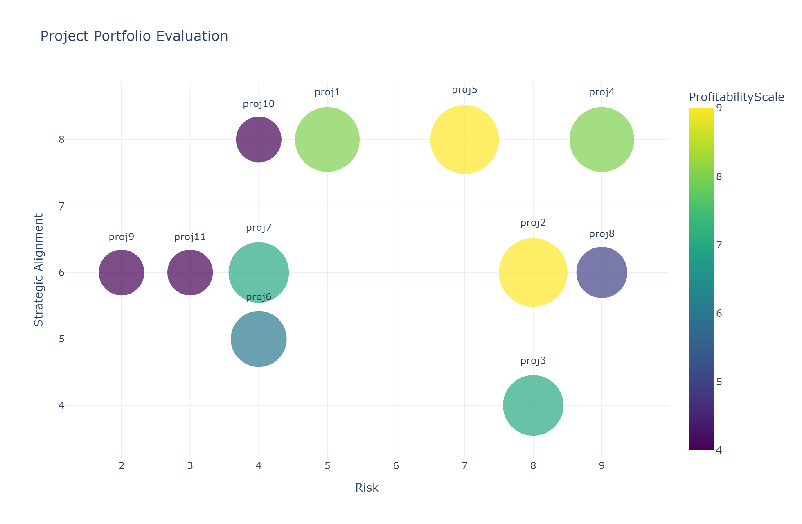
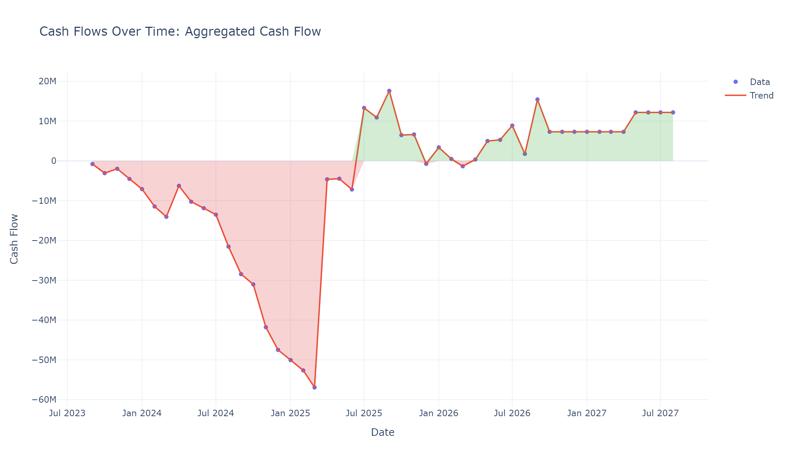
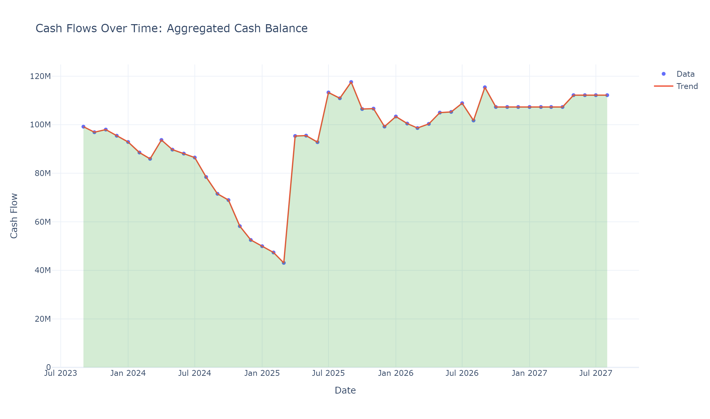

In this project, I analyzed cash-flow data from multiple infrastructure megaprojects and built visualizations to support portfolio decision-making.

The analysis is structured at two levels:

- Project level: monthly cash-flow behavior for each megaproject.
- Portfolio level: aggregated cash flow, aggregated cash balance, and strategic positioning.

## Selected Figures

The portfolio evaluation chart maps projects by Risk and Strategic Alignment, with bubble size/color representing Profitability. It helps frame practical trade-offs instead of relying on a single ranking metric.

The aggregated monthly cash-flow profile highlights portfolio drawdown windows and recovery phases. Diversification helps smooth some volatility, but timing risk remains visible.

The cash-balance trend shows how liquidity evolves over time and why treasury planning is critical when large project outflows cluster in the same periods.

## Key Findings

- Megaproject cash flows are highly volatile, with long negative phases followed by strong recovery periods.
- Portfolio aggregation improves stability but does not eliminate financing pressure windows.
- Portfolio governance should combine risk, strategic alignment, profitability, and timing of cash needs.

The full set of interactive charts and complete consultation notes are available in the repository for readers who want the full deep dive.

## Repository

Full code, case study data, and detailed documentation available on GitHub.
Check out the [GitHub repository](https://github.com/andreabragantini/project-management) for more details and to contribute to the project!