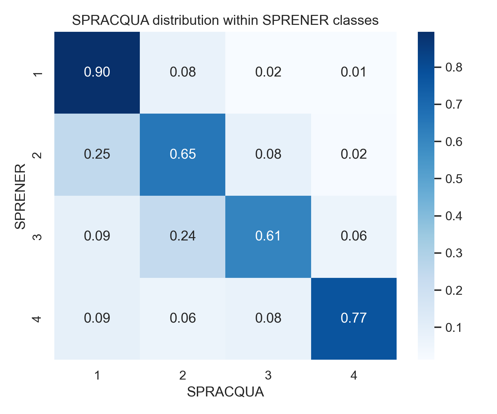
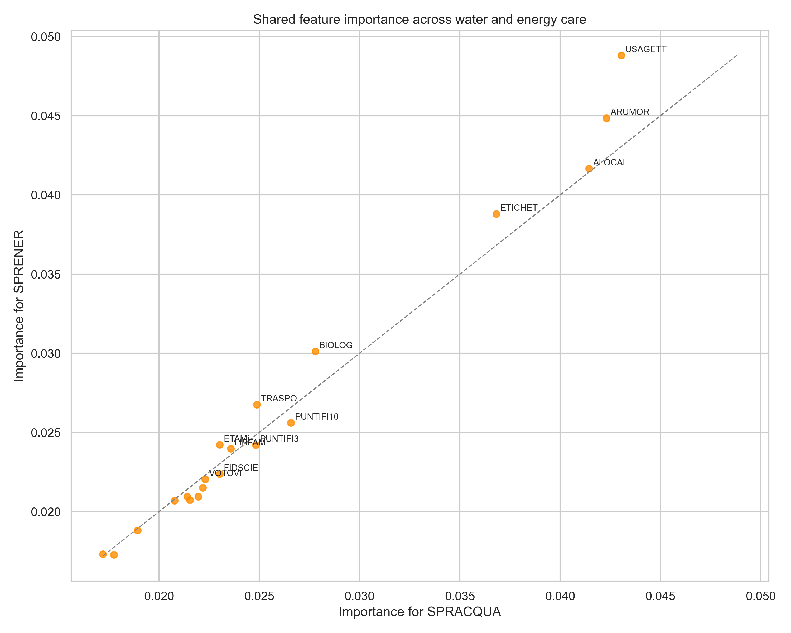
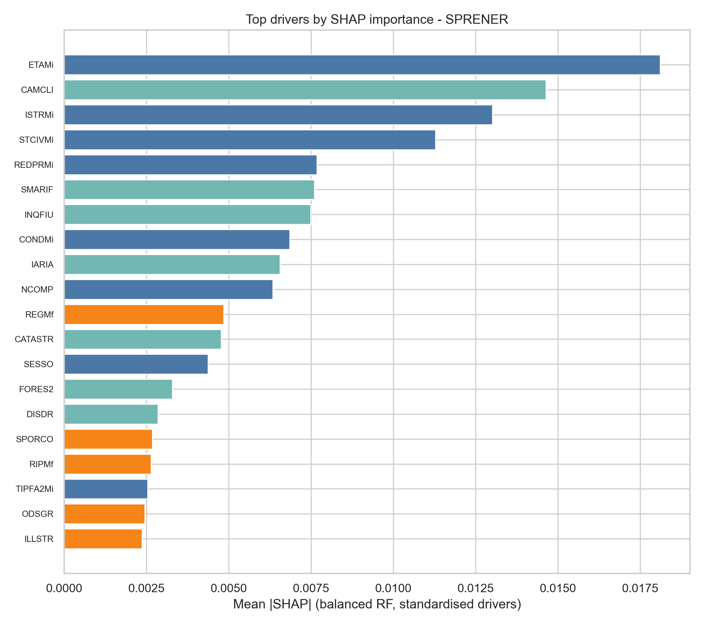

### Introduction

This project is an exploratory data science study of sustainable behaviours using microdata from the 2021 ISTAT AVQ (Aspetti della Vita Quotidiana, Aspects of Daily Life) survey.

Each year, the ISTAT AVQ survey interviews approximately 40,000 Italian households about a wide range of aspects of everyday life. In the 2021 edition, respondents were asked two key questions on environmental behaviour: "How much attention do you pay to avoiding electricity waste?" and "How much attention do you pay to avoiding water waste?" Responses are recorded on a four-point scale ranging from 1 (high attention) to 4 (no attention).

Beyond these two questions, the survey contains hundreds of additional variables describing the same individuals, including their socio-demographic characteristics, daily habits, concerns, opinions, and lifestyles. This provides an opportunity to move beyond asking whether the two sustainability behaviours are related and instead address a broader question: what characteristics are associated with people who are more environmentally conscious?

The objective of this project is to identify the factors that contribute to environmentally responsible attitudes and behaviours. Specifically, it investigates whether attention to saving water and electricity is associated with a broader set of everyday behaviours, attitudes, and socio-demographic characteristics.

Although machine learning models are employed throughout the analysis, this is not primarily a prediction exercise. The emphasis is on interpretation and explanation: understanding which factors are most strongly associated with sustainable behaviours and how they contribute to them.

### Data

The data used originate from the survey «Aspects of Daily Life» of 2021 (2021 AVQ microdata), a survey that is part of the Istat (Italian Institute of Statistics) integrated system of Multi-purpose-household-surveys and that has been carried out every year since 1993. The survey is conducted on approximately 25,000 households residing in around 800 Italian municipalities, representing various demographic sizes. Supporting survey documentation stored in the project materials. Starting from the raw dataset, two target variables are available from surbay data: `SPRACQUA` for attention to water-saving behaviours and `SPRENER` for attention to energy-saving behaviours. Both targets are ordinal, where `1` corresponds to high care and `4` corresponds to low or no care. 

The dataset is very broad and includes:
- family structure and population characteristics. Education and training, private courses, and lessons;
- daily commuting for study or work purposes;
- weekly activities: domestic and non-domestic work;
- leisure time: sports, socializing with friends, reading, media consumption, cinema, theater, shows, etc;
- use of new technologies: Internet and personal computers;
- social and political participation (involvement in associations, etc.);
- citizen and services: utilization and satisfaction with hospitals and other healthcare services, registry and administrative offices,post offices, local health authorities, banks, transportation, electricity and gas services, and waste recycling services;
- lifestyles: eating habits, beverages, smoking;
- health conditions and chronic diseases, medication usage, domestic accidents;
- housing and living area, changes in housing;
- family’s economic situation;
- satisfaction with the past year;
- subjective well-being and trust.

### Project Overview

The study is organised around three research goals: the **human characteristics** behind eco-behaviour (demographics and environmental attitudes), the **consumption context** (household situation, services available), and the **living area** (region, neighbourhood problems). All the data from the survey was grouped into semantic blocks — socio-demographics, environmental worries, consumption behaviours, and spatial factors.

The methodology combines preprocessing, exploratory analysis, dimensionality reduction, clustering, and a final Random Forest stage. In this project, Random Forest is not used primarily for prediction. Instead, it is used as an exploratory tool to rank features by their association with the two targets and to identify the variables that are consistently important across both outcomes.

The pipeline is honest and incremental: clean and reduce the data, explore, cluster, screen with random forests, and finally formalise the findings with statistical models designed for ordered outcomes. Each step is a separate script, so the whole story is reproducible from raw data to final tables.

### Key Findings

The first result jumped out immediately: **the two habits are essentially one disposition.** About 70% of respondents say they are "always careful" with energy *and* the same people are the ones who say they are careful with water.
This means that the overall pattern is consistent with a broader sustainability profile: attention to energy and water saving is associated with attention to other sustainable consumption and behavior choices.

The second finding is that the two targets share a very similar set of top-ranked features.
Both targets produced nearly identical top lists — the strongest correlates were other sustainable-consumption behaviours (reading labels, buying local and organic food, avoiding noisy driving), followed by institutional trust and "cultural capital" like books in the household. But no single variable dominates, and the models only reach a balanced accuracy of about 0.52 (chance is 0.25). 
This means that **the signal is real but weak and diffuse.** Sustainability looks like a broad, cross-cutting attitude rather than something explained by one or two factors.

The most interesting design decision came from a moment of honesty: the strongest predictors of "care for energy/water" were *other behaviour questions from the same survey section*. If I had left them in, the models would trivially predict one habit with its mirror habits. So I removed them and refocused on what truly defines a person: **who you are, what worries you, and where you live.**

That refocusing produced the cleanest result of the whole project. An **ordinal regression model** (the right tool when your outcome is a 1-to-4 ordered scale) showed that:

- **Age is by far the strongest driver.** Each standard-deviation increase in age roughly halves the odds of being a low-care respondent; one SD of age raises the probability of "high care" by about 7 percentage points.
- **Environmental worry is the second pillar.** All 15 "what worries you" items (climate change, waste, pollution of rivers and seas...) were reliably selected, and every single one pointed the same way: more worry, more care. Climate change was the strongest of the lot.
- **Where you live matters least.** Region and macro-area count for something; neighbourhood problems like traffic or the presence of recycling stations barely do.

A nice robustness touch: I collapsed the 4-level target into "care vs. no care" and refitted everything as a plain logistic regression. The two models agreed in sign for every driver that was significant in both — so the findings are not an artefact of one particular model.

### Lessons Learned

Three lessons stand out.

First, **importance is not direction.** Random forests rank variables beautifully but say nothing about whether a factor pushes people toward or away from a behaviour. Reaching for proper statistical models (*ordered models*) — with odds ratios, marginal effects and p-values — turned a vague ranking into an actual story about people.

Second, **be suspicious of correlated predictors.** The single most important methodological choice was excluding variables that were effectively the same behaviour in disguise. It forced the analysis to ask the interesting question instead of the trivial one.

Third, **a negative result is still a result.** The clustering step found almost no meaningful "sustainable citizen" segments — which, turned around, is itself evidence that sustainability is a diffuse disposition that runs through everyone's life rather than a defining identity. I chose to report it rather than hide it.

### Future Improvements

The next steps are to test causality (panel data or natural experiments), to check whether the pattern holds in other countries or other years of the same survey, and to compare self-reported care with actual metered consumption. The gap between what people say and what they do would be a fascinating study on its own.

### Repository
Check out the [GitHub repository](https://github.com/andreabragantini/sustainable_behaviours_study) for more details and to contribute to the project!
	