# Germany 2025 Power Market Analysis

> **Project Context**: This report documents the solution to a data analysis exercise on the German electricity market for the year 2025. Two raw datasets were provided: power demand and day-ahead electricity prices, and the goal was to explore data quality, compute annual metrics, and uncover seasonal and structural patterns in the given data-sets.

NB: datasets are publicly available in the project repository.

---

## Table of Contents

1. [Data Quality & Preprocessing](#1-data-quality--preprocessing)
2. [Annual Market Metrics](#2-annual-market-metrics)
3. [Seasonal & Monthly Demand Analysis](#3-seasonal--monthly-demand-analysis)
4. [Daily & Hourly Dynamics](#4-daily--hourly-dynamics)
5. [Correlation & Market Insights](#5-correlation--market-insights)
6. [Conclusions](#6-conclusions)

---

## 1. Data Quality & Preprocessing

### 1.1 Datasets Overview

Two datasets were provided, both covering Germany in 2025:

| Dataset | Frequency | Observations |
|---|---|---|
| `Demand_2025.csv` | 15 minutes | Power demand in MWh/h |
| `PowerPrice_2025.csv` | Hourly → 15-min (from Oct 1) | Day-ahead price in EUR/MWh |

### 1.2 Key Data Quality Issues

#### Power Price Data
The price dataset was **clean** — no missing values, no duplicate timestamps, and no outliers. However, it contains an important structural change: **from October 1st, 2025, Germany transitioned its day-ahead power market from hourly to 15-minute resolution**, in line with the European `SIDC` (Single Intraday Coupling) framework rollout.

This means the price timeseries has two distinct regimes:

- **Jan 1 – Sep 30, 2025**: One price per hour → 6,552 observations.
- **Oct 1 – Dec 31, 2025**: Four prices per hour → 8,784 observations.

> ⚠️ **Critical implication**: Naively averaging all price rows gives 4× more weight to the post-October 15-minute entries. This must be corrected at analysis time by resampling to a common hourly frequency before averaging.

#### Power Demand Data
The demand dataset was significantly more problematic:

| Issue | Count | Description |
|---|---|---|
| **Missing timestamps** | 67 | Timestamps entirely absent from the 15-min sequence |
| **NaN values** | 305 | Present values recorded as missing |
| **Outliers** | 5 | Visually detectable, confirmed by rolling median |

**Timezone Handling**: Both datasets were provided in CET (Central European Time) notation, which varies seasonally between UTC+1 (winter) and UTC+2 (summer). All timestamps were normalized to UTC for reliable arithmetic and then stored in a separate `Europe/Berlin`-localized column for display purposes.

### 1.3 Outlier Detection

Outliers in the demand timeseries were detected using a **rolling median** approach with a centered 96-step window (1 day of 15-minute data). Data points deviating more than **25,000 MWh** from the rolling median were flagged as outliers.

```
Rolling Median Threshold = 25,000 MWh (empirically chosen)
→ 5 outliers detected and replaced with NaN
```

The rolling median method is preferred over global thresholds (e.g., z-scores) because it adapts to the natural seasonal and time-of-day structure of the demand signal.

### 1.4 Imputation Strategy

After marking outliers and filling missing timestamps, the dataset contained **372 NaN values** in total. A multi-step imputation pipeline was applied:

| Step | Method | Gap Coverage | NaNs Resolved |
|---|---|---|---|
| 1 | **Linear time interpolation** (limit: 8 periods = 2 hours) | Small gaps (≤2 hours) | 48 |
| 2 | **Seasonal shift — same quarter, previous day** (shift 96) | Medium gaps (few hours to 1 day) | 236 |
| 3 | **Seasonal shift — same quarter, previous week** (shift 96×7) | Large gaps (multi-day) | 88 |

After all three steps: **0 NaN values remaining**.

The logic is data-driven and grounded in the periodic nature of electricity consumption: demand at 08:00 on a Tuesday is very similar to demand at 08:00 on the previous Tuesday, especially for the same quarter-hour slot.

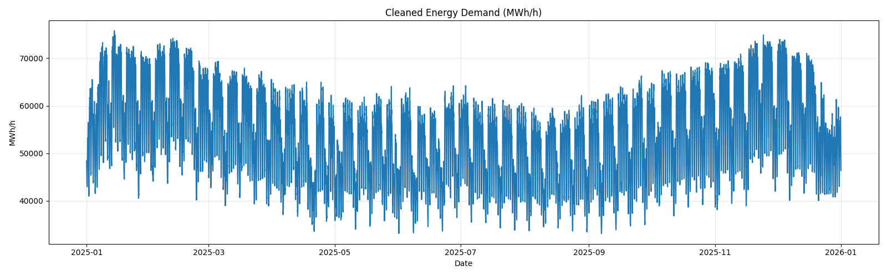

*The cleaned and fully imputed demand timeseries for Germany 2025.*

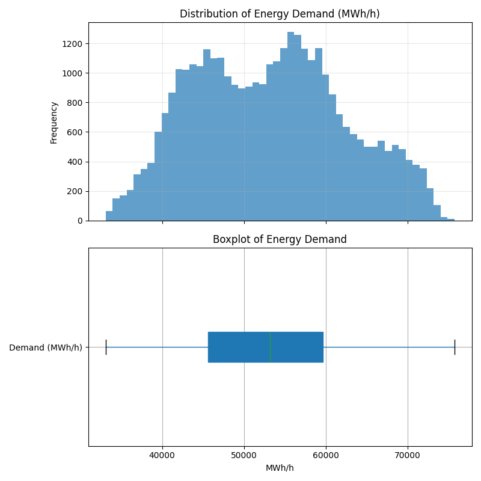

*Distribution of demand values after cleaning. The histogram and boxplot confirm the absence of extreme outliers in the cleaned data.*

---

## 2. Annual Market Metrics

### 2.1 Total Yearly Demand

The demand data is expressed in **MWh/h** (average megawatt over each 15-minute interval). To convert to total energy consumed:

$$\text{Total Energy (MWh)} = \sum_{i} \text{Demand}_i \times \Delta t_i = \sum_{i} \text{Demand}_i \times 0.25 \text{ h}$$

Resampling to hourly means first, then summing:

| Category | Total Demand |
|---|---|
| **Measured (raw data)** | **460.02 TWh** |
| **Imputed (gap-filled)** | **5.77 TWh** |
| **Total 2025** | **465.78 TWh** |

The imputed portion represents only **1.24%** of total demand — a very small fraction, confirming that the data quality was overall good and the gaps were isolated.

> For reference, Germany's electricity consumption in 2025 was approximately **480 TWh** (ENTSO-E estimate), suggesting a slight underestimation likely due to regional reporting boundaries in the dataset.

### 2.2 Yearly Average Day-Ahead Price

As noted in Section 1.2, computing a naïve mean of the raw price series yields a biased result because post-October 15-minute entries receive 4× more weight. The correct approach is to **resample to hourly resolution** (taking the mean of sub-hourly intervals) before computing the annual average:

```
Naïve average (raw rows):     ~89.5 EUR/MWh  ← BIASED
Hourly-resampled average:     89.32 EUR/MWh  ← CORRECT
```

**Yearly Average Day-Ahead Price: 89.32 EUR/MWh**

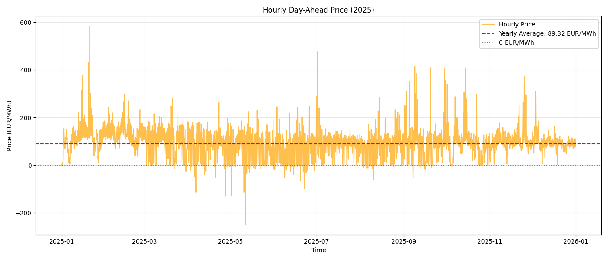

*Hourly day-ahead price for Germany 2025. The red dashed line shows the yearly average (89.32 EUR/MWh). The gray dashed line marks 0 EUR/MWh, which is periodically crossed by negative price spikes — a structural feature of power markets with high renewable penetration.*

---

## 3. Seasonal & Monthly Demand Analysis

### 3.1 Seasonal Patterns in Demand

Visual inspection and time-series decomposition reveal **four overlapping seasonal patterns** in the demand signal:

1. **Intraday cycle**: Demand is low at night (00:00–06:00), rises sharply in the morning (06:00–09:00), plateaus during business hours, and drops in the evening.
2. **Weekly cycle**: Weekday demand is significantly higher than weekend demand, driven by industrial and commercial activity.
3. **Annual cycle**: Demand peaks in winter (heating, lighting) and reaches a local minimum in summer. A secondary smaller peak occurs in mid-summer due to air conditioning loads.
4. **Holiday effects**: Public holidays and Christmas/New Year breaks show significantly lower demand profiles, similar to weekend patterns.

#### Time-Series Decomposition (MSTL)

MSTL (*Multiple Seasonal-Trend decomposition using LOESS*) was applied to decompose the demand into:

- **Trend**: The slow-moving baseline (energy intensity and economic activity)
- **Seasonal Daily**: The recurring intraday pattern
- **Seasonal Weekly**: The Monday–Sunday cycle
- **Residual**: Irregular shocks and unexplained variation

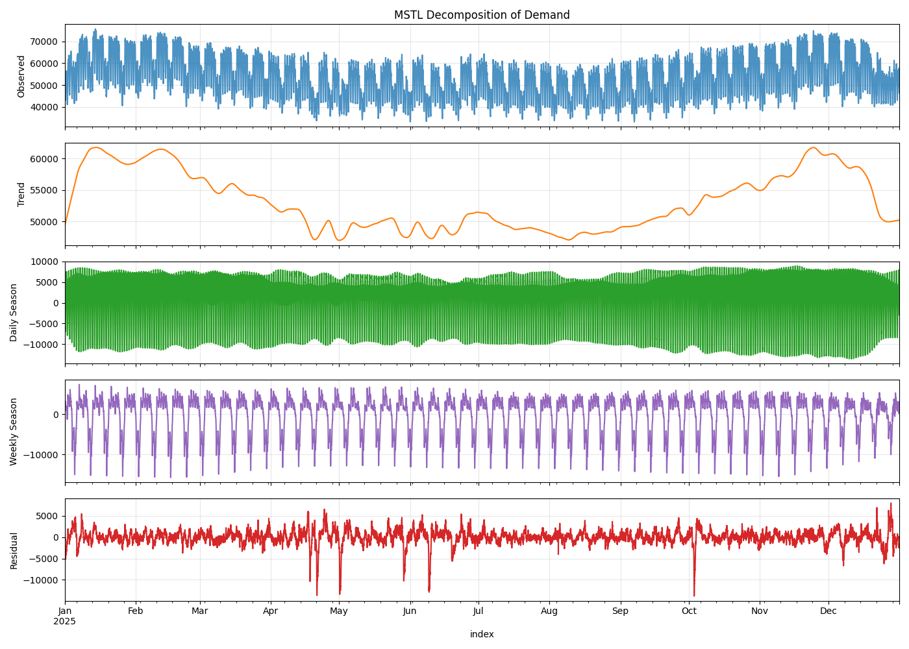

*MSTL decomposition of the demand timeseries into its structural components. The trend shows a clear winter–summer–winter shape. The daily seasonality captures the morning ramp-up and evening ramp-down. The weekly seasonality separates weekdays from weekends.*

#### Intraday Demand Profile

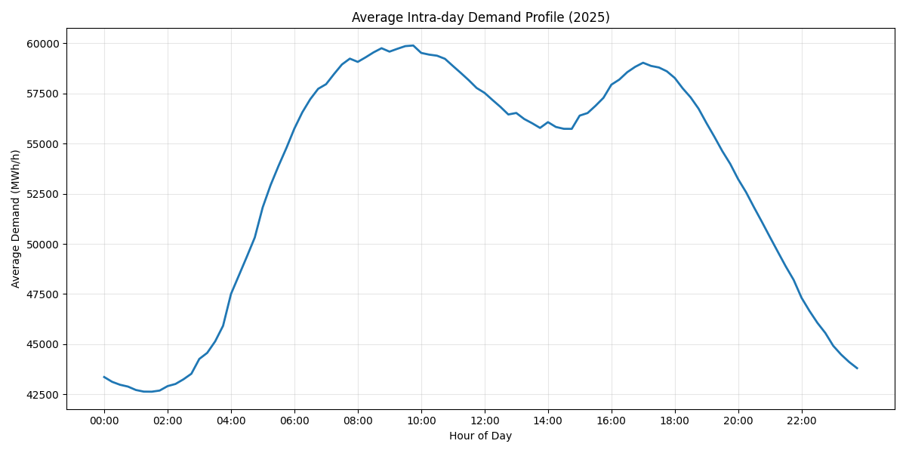

*Average 24-hour demand profile across all of 2025. The morning ramp (06:00–09:00) and evening plateau (17:00–21:00) are the characteristic double-peak structure of European residential and industrial demand.*

#### Weekly Demand Profile

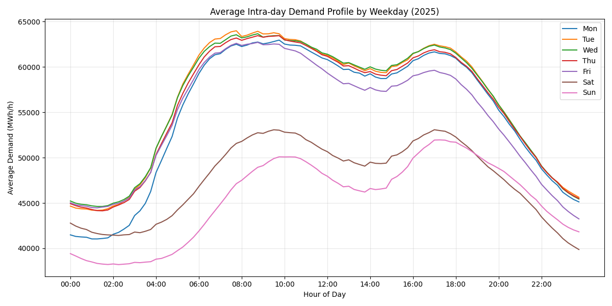

*Intraday demand profiles by day of the week. Monday through Friday show similar high-demand profiles. Saturday is intermediate, and Sunday is the lowest, reflecting the cessation of most industrial activity.*

### 3.2 Monthly Comparison

The following four metrics are compared across all 12 months:

- **Total Monthly Demand (TWh)**: Total energy consumed.
- **Peak Load (MWh/h)**: Highest instantaneous demand recorded.
- **Base Load (MWh/h)**: Minimum instantaneous demand (typically overnight in summer).
- **Demand Volatility (std of MWh/h)**: Standard deviation, capturing how much demand fluctuates within the month.

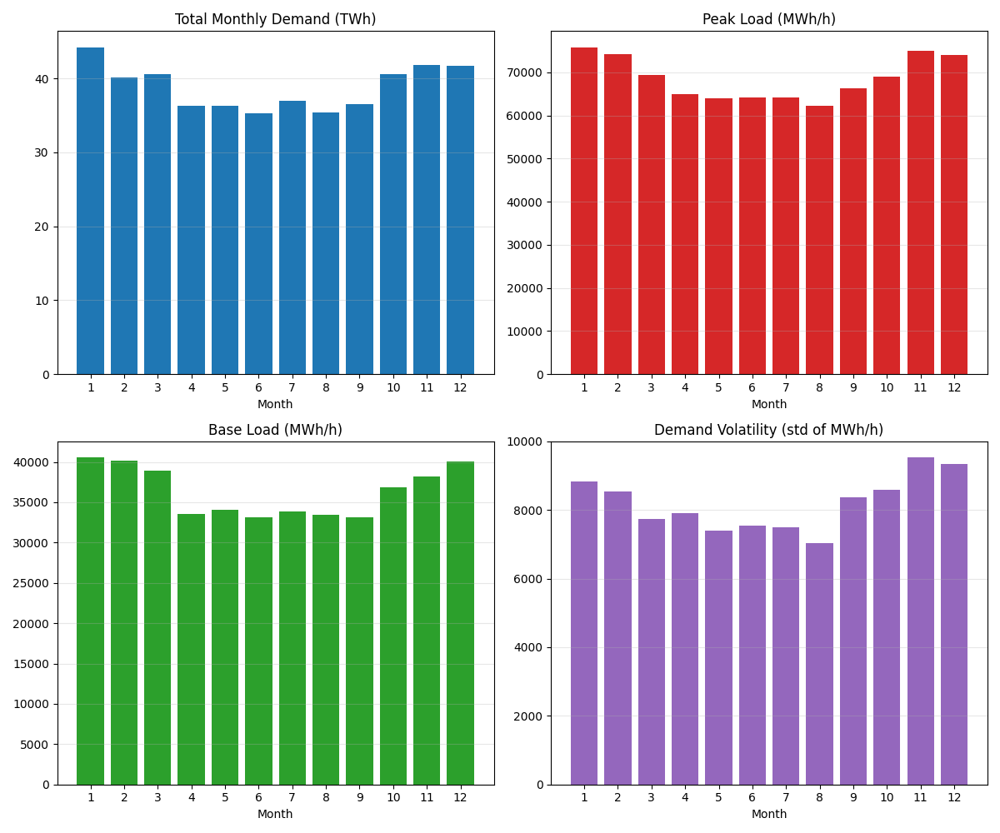

*Four-panel comparison of monthly demand characteristics. Key observations:*

| Observation | Insight |
|---|---|
| **January and February** have the highest total demand | Cold winters drive heating loads |
| **June, July, August** have the lowest total demand | Mild temperatures reduce heating, limited AC penetration |
| **Peak load** is highest in winter months | Cold snaps with widespread electric heating drive spikes |
| **Base load** is lowest in summer | Overnight summer loads are minimal |
| **Volatility** is highest in January/February | Cold weather events create large swings in demand |

---

## 4. Daily & Hourly Dynamics

### 4.1 Daily Demand Variation Across the Year

Total daily demand varies considerably across the year. The dual-axis plot below shows how the daily price tracks (imperfectly) with the daily demand total:

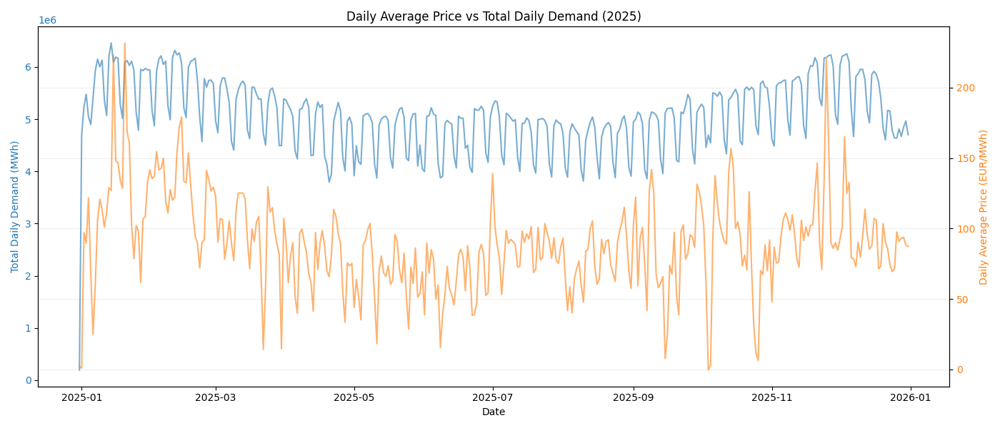

*Dual-axis comparison of daily average price (orange) and total daily demand (blue). Both series exhibit similar seasonal patterns — higher in winter, lower in summer — though the relationship is noisy at the daily level.*

### 4.2 Hourly Price Analysis — When Are Prices Highest and Lowest?

The intraday price profile reveals a characteristic **double-peak structure** driven by the demand pattern:

- **Morning peak (07:00–10:00)**: Demand ramps up rapidly, pushing prices higher.
- **Midday trough (12:00–15:00)**: Solar power generation peaks in summer, creating a mid-day supply surplus and depressing prices (the "duck curve" effect).
- **Evening peak (17:00–20:00)**: The highest prices of the day, when demand remains elevated but solar drops off.
- **Night valley (00:00–06:00)**: Minimum prices, when demand is low and base-load plants must continue generating.

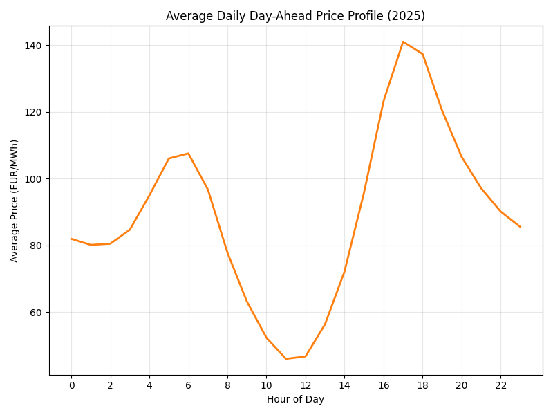

*Average day-ahead price by hour of the day across all of 2025. The evening price peak (around 18:00–19:00) and the overnight minimum are clearly visible.*

### 4.3 Summer vs Winter Price Comparison

The summer/winter split reveals structurally different price dynamics:

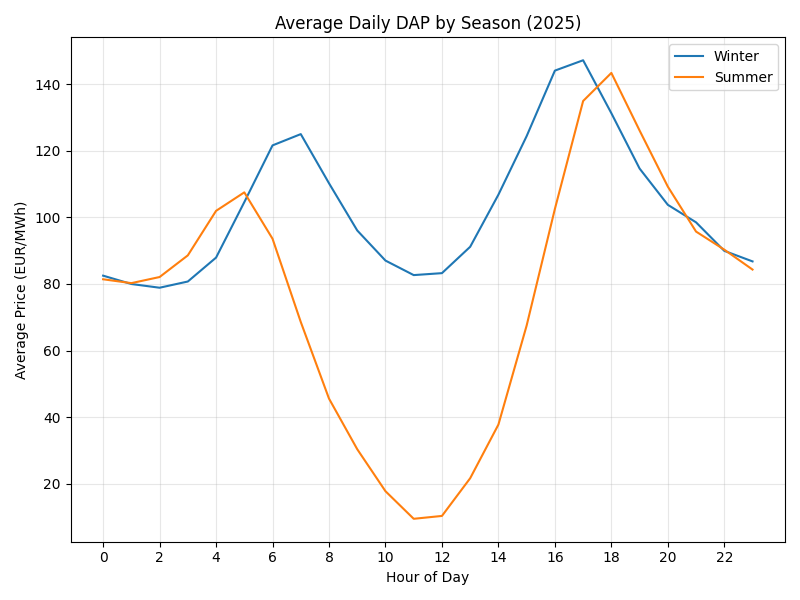

*Comparison of hourly price profiles between Winter (October–March) and Summer (April–September).*

| Time of Day | Winter | Summer |
|---|---|---|
| **Morning** (07:00–10:00) | High prices from heating loads | Moderate — demand is lower |
| **Midday** (11:00–15:00) | Moderate — some solar input | **Lowest of day** — solar surplus drives prices down |
| **Evening** (17:00–20:00) | **Highest of year** — peak heating demand | High, but less extreme |
| **Night** (00:00–06:00) | Low — base-load runs | Lowest overall in summer |

> The solar "duck curve" is distinctly visible in the summer profile: prices drop sharply from 10:00 to 14:00 as solar panels reach peak output, then rapidly recover in the evening as solar disappears and demand remains high.

### 4.4 Weekday Price Profiles

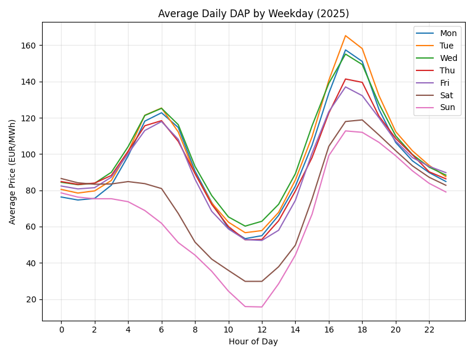

*Hourly price profiles by day of the week. Weekday prices are uniformly higher during business hours due to industrial load. Weekend prices are noticeably lower, particularly on Sunday.*

---

## 5. Correlation & Market Insights

### 5.1 Price–Demand Relationship

The relationship between power price and demand is real but **not straightforward**. The main challenge is separating the **seasonal trend** (both price and demand rise in winter) from the **actual short-term market response** (does higher demand on any given day push the price up?).

#### Standard Correlation

| Metric | Value |
|---|---|
| **Pearson Correlation (daily)** | **0.6176** |
| **Detrended Anomaly Correlation** | **0.4599** |

The Pearson coefficient of 0.62 is strong, but it is largely driven by the **shared seasonal trend**: both demand and prices are high in winter and low in summer, not because one causes the other in the short term, but because they both respond to the same underlying driver (temperature/season).

#### Detrended Correlation

By subtracting a **30-day rolling mean** from both series, we isolate the short-term anomalies — "higher than usual for this time of year." The detrended correlation of **0.46** is meaningful and positive: on days when demand is unexpectedly high (e.g., a cold snap in spring), prices tend to be higher than typical for that period. This confirms a **genuine but moderate** market-clearing relationship.

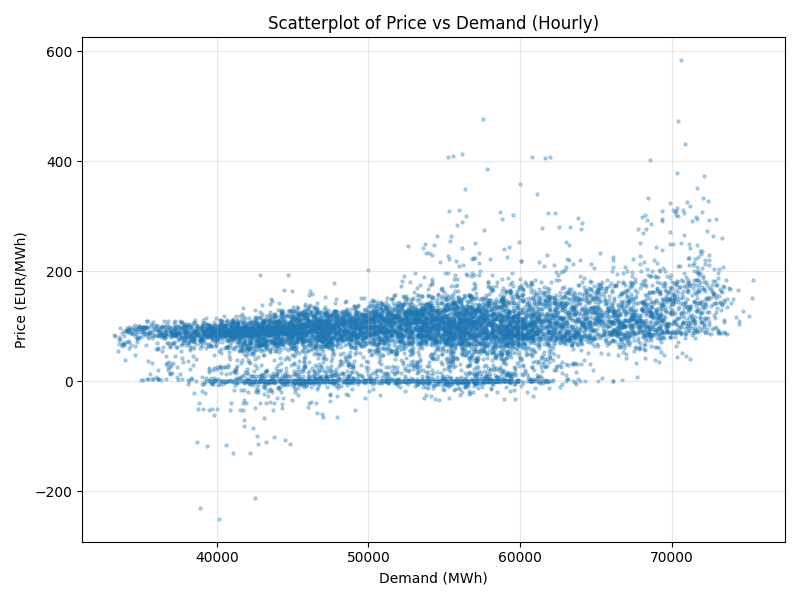

*Scatter plot of hourly price vs. demand across all of 2025. The wide spread reflects the many other drivers of price (renewable generation, cross-border flows, fuel costs) beyond demand alone.*

### 5.2 The October 1st Transition: Impact on Price Dynamics

The switch to 15-minute pricing on October 1st, 2025 is one of the most structurally important events in the dataset. Comparing scatter plots before and after this date reveals:

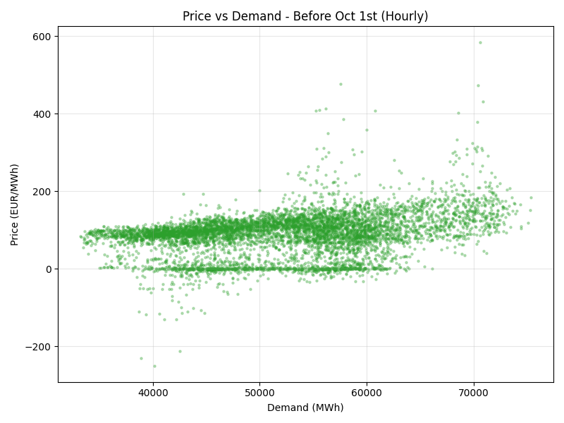

*Before October 1st — Hourly prices. Note the presence of strongly negative prices at low demand levels (overnight/weekend solar surplus), and extreme positive spikes.*

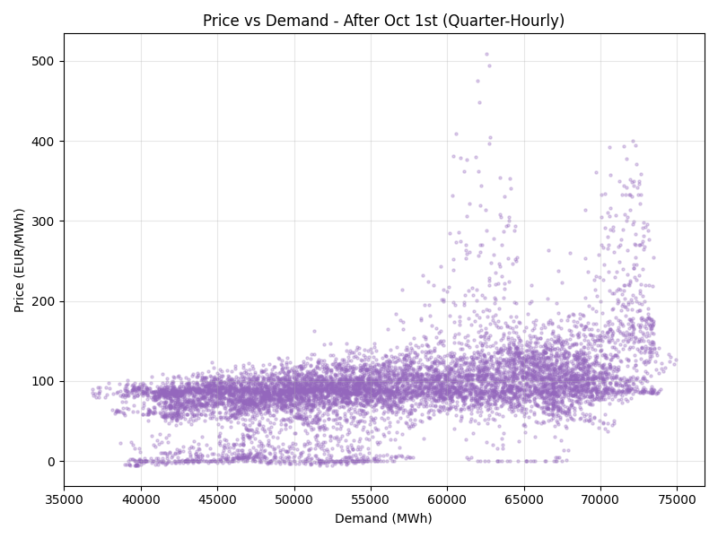

*After October 1st — Quarter-hourly prices. The distribution is notably tighter: negative price spikes are reduced and extreme positive spikes are mitigated.*

**Why does 15-minute pricing improve market efficiency?**

With hourly prices, all generators and consumers must commit to a fixed output for a full hour. This creates large imbalances — for example, if a sudden wind gust produces surplus power at 10:47, the market cannot react until 11:00. With 15-minute pricing:

- **Negative price events are reduced**: Excess renewable generation can be priced out of the market more quickly.
- **Price spikes are dampened**: Demand response and flexible assets can react within 15 minutes rather than waiting an hour.
- **Market liquidity improves**: Finer granularity allows more precise matching of supply and demand.

---

## 6. Conclusions

This analysis of Germany's 2025 electricity market reveals several important findings:

### Technical Findings

| Question | Answer |
|---|---|
| **Total demand (2025)** | **465.78 TWh** (98.76% measured, 1.24% imputed) |
| **Average day-ahead price** | **89.32 EUR/MWh** (hourly-resampled to avoid frequency bias) |
| **Demand seasonality** | Strong winter peak, summer trough, intraday double-peak, weekly cycle |
| **Price seasonality** | Winter peak, summer midday solar trough, evening price spikes year-round |
| **Price–demand correlation** | Pearson: 0.62 (seasonal trend dominated); Detrended: 0.46 (genuine short-term signal) |

### Data Engineering Lessons

1. **Frequency mismatches are dangerous**: The shift in price granularity (hourly → 15-min) on October 1st would silently distort any analysis that ignores it. Resampling to a common frequency is mandatory before aggregation.
2. **Timezone handling requires care**: Europe's CET/CEST seasonal clock changes create ambiguous timestamps during the autumn clock-back and non-existent timestamps during the spring clock-forward. Robust code must handle these explicitly.
3. **Imputation must respect seasonality**: Electricity demand has a very strong time-of-day and day-of-week structure. Imputing large gaps with the same quarter-hour from the previous day or week is far superior to linear interpolation alone, which assumes a monotone trend between neighboring points.
4. **Correlation ≠ causation, and seasonal trends inflate it**: Without detrending, the correlation between price and demand appears very strong (0.62) but is largely spurious. The true market-clearing relationship, measured on detrended anomalies, is 0.46 — still meaningful but more honest about the other factors driving prices (wind, solar, cross-border flows, gas prices).

### Market Insights

The 15-minute price market mechanism, introduced across Germany on October 1st, 2025, represents a significant structural improvement in the efficiency of electricity markets. The data confirms that negative price occurrences and extreme price spikes both decrease after the transition — even during a season (autumn/winter) that is typically associated with supply stress. This supports the broader European ambition to integrate increasingly variable renewable generation through finer market granularity.

---

*This report was produced as part of a data analysis portfolio project. All findings are derived from the provided datasets using the `power_market_analysis` Python package available in the project repository.*
