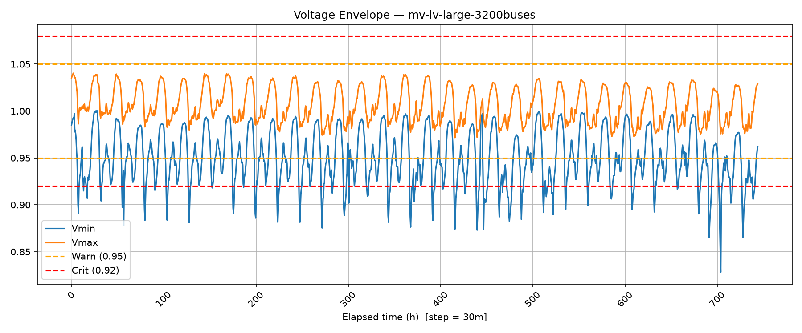
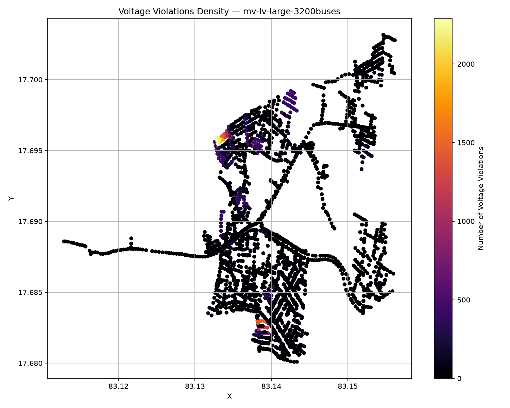
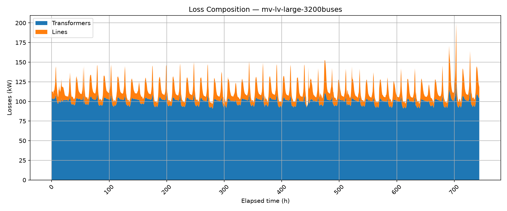

# Introduction

Distribution system operators face a growing challenge: how do you reliably assess voltage quality, equipment stress, and energy losses across a network that may span thousands of buses, dozens of transformers, and years of time-series data? Manual inspection of each bus and each timestep is infeasible.

I built **Power Grid Analyzer** to automate this process. The project wraps the OpenDSS simulator (the industry-standard distribution system solver) with a Python pipeline that runs long-duration time-series simulations, extracts key performance indicators at every timestep, detects violations against configurable thresholds, quantifies losses, and produces publication-ready visualizations — all with zero manual intervention.

The tool has been validated on two real-world distribution network models: a 76-bus low-voltage network (dataset publicly available) and a much larger 3200-bus MV-LV system with photovoltaic generation (private dataset, non disclosable), and it is designed to accept any OpenDSS-compatible model with minimal configuration.

# Project Overview

At its core, the project implements a **monitor-aggregate-visualize** pipeline:

1. **Monitor** — At each simulation timestep, three monitors scan the entire network: a voltage monitor checks every bus and phase against per-unit thresholds, a transformer monitor tracks loading and copper losses, and a line monitor does the same for every branch.
2. **Aggregate** — Raw timestep data is stored as Parquet files. The post-processing layer then computes derived KPIs such as energy losses (kWh integrated over the full horizon), violation rates, and normalized loss ratios.
3. **Visualize** — Two parallel visualization engines produce output: a legacy pipeline generates static matplotlib PNG figures, while a newer pipeline creates interactive Plotly HTML dashboards.

The architecture is intentionally **case-isolated**: each network model lives in its own directory under `cases/`, and all outputs are organized under `data/<case>/` and `results/<case>/`. This makes it trivial to add new networks without touching a single line of analysis code.

# Key Features

- **Automated violation detection** with two-tier thresholds (warning / critical) for voltage (0.95/0.92 pu low, 1.05/1.08 pu high), transformer loading (70%/90%), and line loading (70%/90%).
- **Loss quantification** — active power losses (kW) per timestep, integrated energy losses (kWh), and normalized loss ratios (loss per ampacity) to identify inefficient equipment.
- **Spatial awareness** — when geographic bus coordinates are available, violations and losses are plotted on a GIS-style map; otherwise, a NetworkX graph with BFS hierarchical layout is used, preserving the radial structure of distribution grids.
- **Dual output format** — static PNG images for reports and interactive HTML charts for exploratory data analysis.
- **Ranked offender lists** — top-10 most-violated buses, lines, and transformers by critical violation rate, making it easy to target mitigation efforts.

# How It Works

The main entry point (`main.py`) accepts a `--case` argument and follows a three-stage workflow:

1. **Context building** — The `Master_Timeseries.dss` file is parsed to extract voltage bases, simulation mode, stepsize, and feature flags (MV/LV split, PV systems, bus coordinates). All output paths are computed from the case name.
2. **Time-series loop** — The OpenDSS engine is initialized via `dss-python`, the master file is compiled, and the number of timesteps is auto-detected from the load shape length. For each step, the three monitors run and append their results to in-memory DataFrames. At the end, these are written to Parquet.
3. **Post-processing** — Four modules run in sequence: time analysis (9 charts), spatial analysis (grid maps with overlay), loss analysis (composition, scatter, hotspot maps, energy summary), and ranking (text tables and bar charts).

A critical design choice was to store intermediate data as **Parquet** rather than CSV or a database. This keeps the pipeline lightweight (no external services), enables columnar compression, and integrates seamlessly with pandas and PyArrow.

# Results

The pipeline was run on the `mv-lv-large-3200buses` case study — a mixed MV-LV network with approximately 3200 buses, multiple transformers, and photovoltaic generators operating under a yearly simulation with 30-minute resolution.

## Voltage Quality

The voltage envelope plot reveals the full spread of per-unit voltages across all buses and phases over the simulation horizon. Even in a well-designed network, voltage excursions near the critical thresholds are visible during peak loading periods. The violation count chart shows that undervoltage warnings cluster during the evening load pickup, while overvoltage events correlate with midday PV injection.

The spatial voltage violations map overlays the network topology with a color gradient representing violation density — a quick visual diagnostic for weak areas of the grid.

## Transformer and Line Stress

Transformer loading charts show that most units operate well below the 70% warning threshold, but a small number of critically loaded transformers approach 90% during peak demand. The tool flags these automatically and ranks them by critical violation rate.

Line loading follows a similar pattern, with the most heavily loaded feeders concentrated in the LV sections of the network. The spatial heatmap of line overloads makes these hotspots immediately visible.

## Loss Analysis

The loss composition chart breaks down total network losses into transformer copper losses and line resistive losses. For the 3200-bus network, line losses dominate during high-load periods, while transformer losses remain relatively constant — a typical pattern for well-sized distribution transformers.

The normalized loss ratio (loss per ampacity) identifies transformers that are not just heavily loaded but inefficient. These are the units where replacement or parallel connection would yield the highest return.

## Rankings

The top-10 offender lists provide actionable output for grid operators:

- **Top violation buses** highlight nodes where voltage exceeds thresholds most frequently — candidates for tap changer adjustment or capacitor bank placement.
- **Top violation transformers** point to units requiring upgrade or load transfer.
- **Top violation lines** identify feeder sections that may need reconductoring or network reconfiguration.

# Lessons Learned

**1. OpenDSS file formats are heterogeneous, even within the same tool.** The two case studies use different conventions for line definitions (single file vs. MV/LV split), source definition (Vsource vs. Circuit object), and coordinate data. The pipeline had to be made adaptive rather than prescriptive.

**2. Parquet is a game-changer for engineering data.** Writing per-timestep snapshots as CSV would have produced gigabytes of text. Parquet with dictionary encoding and zstd compression kept the storage footprint manageable while preserving full precision and schema.

**3. Static vs. interactive visualization both have a place.** Static PNGs are ideal for embedded report figures and email attachments. Interactive HTML charts (Plotly) are better for exploratory analysis — zooming into a specific time window, hovering over a bus to see its exact voltage, or filtering by violation severity. Maintaining both output modes adds complexity but serves different use cases.

# Future Improvements

- **Time-of-use tariff integration** — overlay tariff periods on the loss and loading charts to quantify energy costs.
- **Mitigation recommendation engine** — suggest specific remedial actions (capacitor sizing, transformer upsizing, line reconductoring) based on violation patterns.
- **Web dashboard** — wrap the post-processing outputs in a lightweight dashboard (e.g., Streamlit or Dash) for non-technical stakeholders.
- **Contingency analysis** — run N-1 scenarios automatically by opening each line in turn and re-running the simulation to identify single-point-of-failure risks.

# Repository

Full code, case study data, and detailed documentation available on GitHub.
Check out the [GitHub repository](https://github.com/andreabragantini/power-grid-analyzer-dss) for more details and to contribute to the project!
