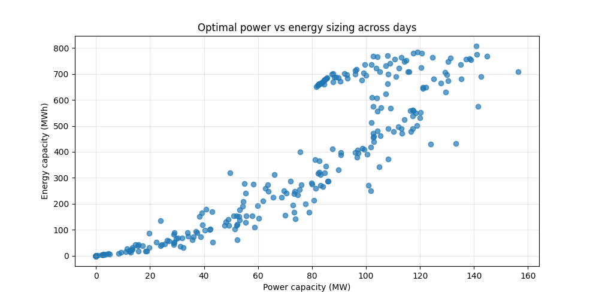
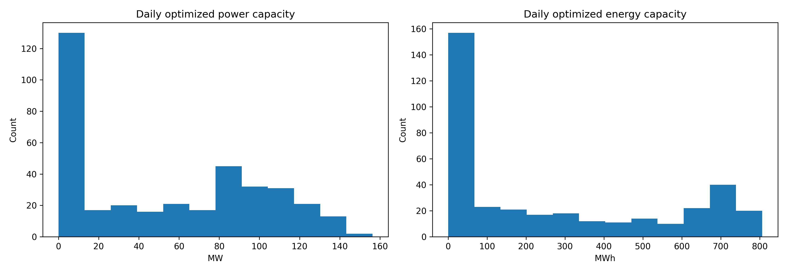
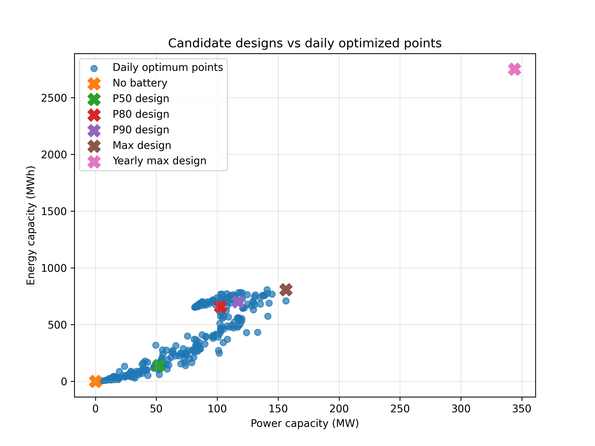
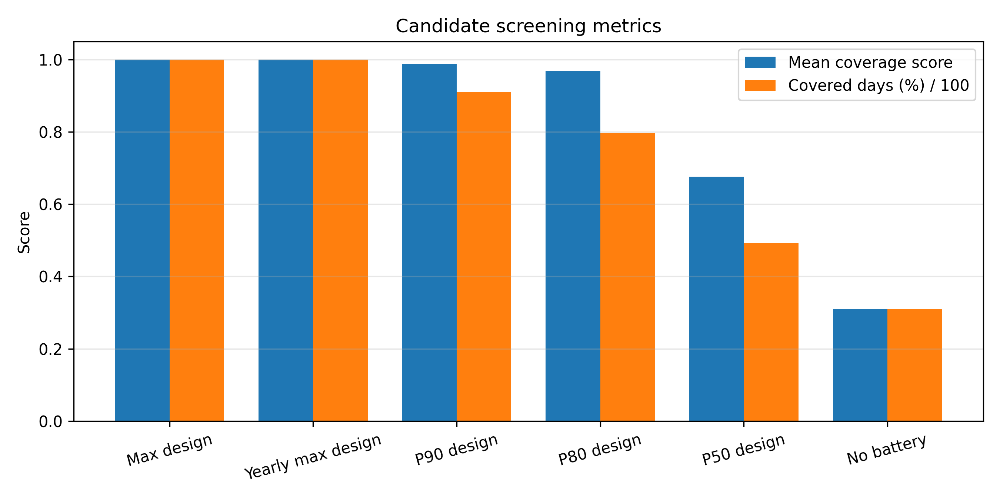
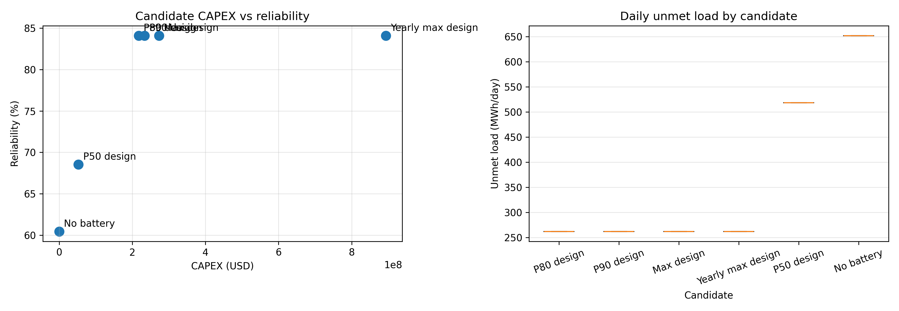
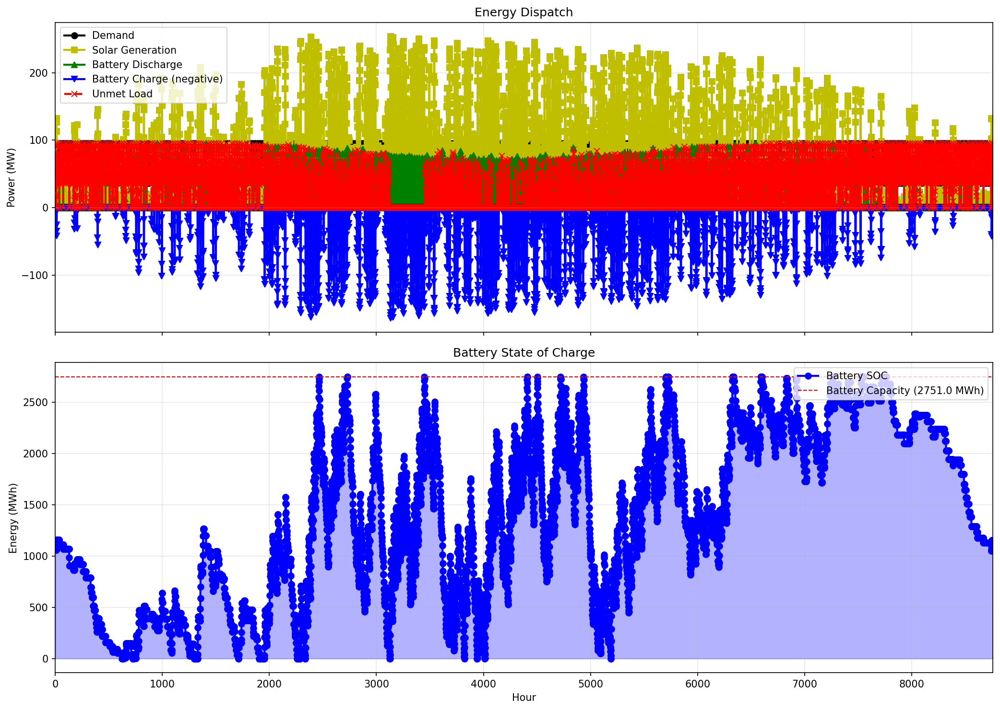
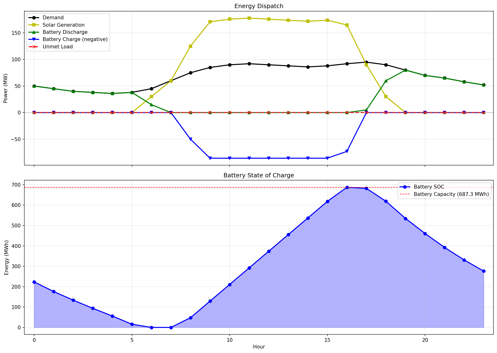

# Introduction

The optimal sizing of Battery Energy Storage Systems (BESS) is a multidimensional optimization problem. It aims to identify the combination of power capacity (MW) and energy capacity (MWh) that maximizes the economic value of the investment while satisfying technical and operational constraints. The size of the battery is therefore determined by two variables: power capacity (the instantaneous power the asset can provide) and energy capacity (the total energy the asset can store). Unlike conventional generation assets, BESS profitability depends not only on installed capacity but also on how effectively the system exploits multiple value streams throughout its lifetime.
Generally, a BESS relies on revenue stacking. This is the practice of combining multiple revenue streams, usually from:

* Energy arbitrage: Buying energy when prices are low and reselling when prices are high.
* Ancillary services: Participating in markets to stabilize the power grid.
* Capacity markets: Receiving payments simply for providing availability to respond to grid events.

Consequently, optimal sizing requires a holistic assessment that integrates technical performance, market participation, financial viability, and long-term asset degradation.

Despite this complex background, this project provides a simple, initial suite of Python tools to solve the first-guess BESS sizing problem for sites with large solar plants. While comprehensive battery sizing involves economics, uncertainty, and grid integration, this project focuses exclusively on energy balance constraints for the sake of simplicity. It serves as a first-guess design tool by sizing the battery primarily using demand and solar generation profiles.

The repository provides two complementary tools:

- `Optimizer`: finds battery power (MW) and energy (MWh) endogenously using linear programming.
- `Simulator`: evaluates fixed battery designs using chronological dispatch simulation.

That split is the key idea behind the project: optimization proposes, simulation verifies.

# Project Overview

The project models a simple but useful system boundary: one demand profile, one solar asset, and one battery energy storage system (BESS), without a grid import backstop. Within that boundary, the model answers two different planning questions.

Question 1: "What battery size minimizes cost while avoiding unmet demand as much as possible?" That is solved with `Optimizer`.

Question 2: "Given a specific battery size, how does the system perform over time?" That is solved with `Simulator`.

This distinction matters because many battery projects fail when they rely only on optimization outputs from limited windows (for example, representative days) and skip longer-horizon validation. A design can look excellent in a daily optimization context and still underperform across a full year.

The workflow implemented in the notebooks is intentionally staged:

1. Run daily optimization across many solar profiles.
2. Build candidate fixed designs from quantiles (P50, P80, P90, Max).
3. Simulate each candidate chronologically across the selected evaluation horizon.
4. Compare reliability and cost trade-offs before selecting a design.

# Key Features

The strongest feature in this project is not one algorithm. It is the combination of clean software design and practical decision logic.

The API is clean and explicit. Solar and load are added with simple methods, storage assumptions are set in one place, and each model exposes a shared `get_results()` schema. That means reporting and plotting can stay polymorphic and reusable.

The optimization formulation is transparent. Battery power and energy capacity are decision variables, constrained by duration and state-of-charge physics. Unmet demand is heavily penalized in the objective, which makes the model prioritize reliability within the given system constraints.

The simulation engine is intentionally simple and fast. It applies a greedy forward dispatch with efficiency-aware SOC updates. There is no solver overhead, which makes it easy to run full-year validation for multiple candidates.

The repository also includes analysis outputs ready for communication, not just computation. Scatter plots, histograms, screening charts, and dispatch figures make it easier to explain why a candidate was chosen and what risks remain.

# How It Works

At a high level, the architecture separates shared concerns from model-specific logic:

- `_base.py` handles common input validation, plotting, and report generation.
- `bess_optimizer.py` builds and solves the LP sizing problem with Linopy/HiGHS.
- `bess_simulator.py` runs fixed-size dispatch simulation without optimization.

The optimization model minimizes:

$$
\text{battery capex} + \text{unmet demand penalty}
$$

subject to solar limits, charge/discharge power limits, SOC dynamics, SOC capacity bounds, and an energy-to-power duration cap.

The simulator then replays operation chronologically for a chosen battery size, applying battery limits and round-trip efficiency at each step to compute served load and unmet energy.

A concrete single-day optimization, using the standard data provided within the example scritps, run from the project report sized the battery at:

- 85.91 MW power
- 687.27 MWh energy
- 8.00 hours duration
- 0.00 MWh unmet load for that day

That result is useful, but the project shows why single-day success is not enough to make an investment decision.

# Results

The most important outcome from this work is not "one perfect battery size." It is a quantified trade-off curve that reveals how candidate designs behave under chronological stress tests.

In the latest candidate validation summary (`results/03_candidate_design_screening/candidate_designs_summary.csv`), the tested yearly horizon shows:

- No battery (0.0 MW, 0.0 MWh): 60.44% reliability, 652.0 MWh unmet.
- P50 design (52.0 MW, 140.7 MWh): 68.54% reliability, 518.53 MWh unmet.
- P80 design (102.7 MW, 656.8 MWh): 84.10% reliability, 262.0 MWh unmet.
- P90 design (117.0 MW, 701.0 MWh): 84.10% reliability, 262.0 MWh unmet.
- Max design (156.3 MW, 806.5 MWh): 84.10% reliability, 262.0 MWh unmet.

This is a useful planning insight: once the battery reaches a certain threshold in this scenario, adding more capacity does not reduce unmet load further. The bottleneck is no longer battery size alone; it is the underlying supply-demand shape of the tested period. Simply, there is not enough solar production to satisfy the load, and therefore to charge the battery.

Cost metrics reinforce the same point. P80, P90, and Max deliver equal reliability in the current run, but with increasing capex. In that context, P80 behaves like the best value candidate among the quantile-based designs.

These findings are exactly why the project uses a staged workflow. Quantile-based candidate selection is effective for narrowing options, but chronological validation is what reveals diminishing returns and practical design limits.

The project also includes ready-to-share dispatch visuals from example runs:

# Lessons Learned

Three lessons stood out while building this project.

First, API clarity is part of model correctness. In energy modeling, ambiguity around inputs and outputs can create silent misinterpretation. Separating `Optimizer` (endogenous sizing) from `Simulator` (exogenous validation) reduced that ambiguity and made analysis steps easier to audit.

Second, robust design requires multiple time scales. Daily optimization is great for discovering sizing patterns quickly, but it can lead to wrong design decisions if used alone, under-estimating or over-estimating the BESS size. Chronological simulation changed the interpretation of candidate quality in this project.

Third, penalties are decision levers, not just math constants. A very high unmet-demand penalty helps force reliability-seeking behavior in optimization, but if resource adequacy is structurally limited (for example, no grid import and seasonal solar deficits), penalties mostly reveal infeasibility costs rather than magically creating reliability.

Fianlly, battery sizing is fundamentally a stochastic investment problem. Optimization is useful for identifying candidate designs, while simulation is necessary to validate their performance under realistic conditions. In real projects, market prices, degradation, weather uncertainty, and grid constraints often have a larger impact on the optimal battery size than the average solar profile itself.

# Further Remarks on Optimal Battery Sizing

While the core mechanics of battery sizing always revolve around power (MW) and energy (MWh) capacities, the definition of "optimal" changes fundamentally depending on where the asset sits on the electric grid. When moving beyond simple energy balances, the optimization problem must adapt to distinct operational goals, regulatory frameworks, and physical boundaries across residential, commercial, and utility-scale applications. 

In residential and Commercial & Industrial (C&I) settings, collectively known as **Behind-the-Meter (BTM)** systems, the sizing problem is highly localized and driven by the end-user's consumer behavior and retail tariff structures. In these BTM applications, the BESS sizing problem revolves fundamentally around the availability of surplus renewable energy source (RES) generation. Often, investing in a BESS is difficult to justify if there is a scarcity of surplus energy, as a lack of excess generation means the battery cannot charge enough to achieve economic viability. For a homeowner, optimization is a relatively straightforward pursuit of maximizing self-consumption of rooftop solar and securing backup power. In C&I applications, the stakes are financially higher due to demand charges. Here, the sizing tool must not only optimize for auto-consumption but must also prioritize "peak shaving", strategically sizing and discharging the battery to flatten (unpredictable )demand spikes and protect the facility from expensive utility penalties.

At the utility scale, the localized load profile disappears entirely, and the battery interacts directly **Front-of-the-Meter (FTM)** with the high-voltage transmission grid. For these massive projects, sizing is driven by regional grid dynamics, wholesale market arbitrage, and revenue stacking across ancillary services. Instead of catering to a building's energy footprint, a utility-scale BESS treats the entire regional grid as its source and destination, capitalizing on price spreads created by system-wide congestion.

Consequently, grid constraints emerge as one of the most critical boundary conditions in the utility-scale sizing problem. A project is bound by strict contractual and physical limits, such as the maximum Interconnection Agreement capacity (MW), which places a hard cap on how much power the asset can inject into the grid. Furthermore, local transmission bottlenecks frequently lead to curtailment, forcing solar plants to shut down surplus production. In these scenarios, the optimal BESS capacity is dictated by the need to capture this otherwise wasted energy block and store it until grid congestion clears, transforming a physical network limitation into a core driver of financial viability. 

### Techno-economic assessment

Continuing on the case of utility-scale BESS, from a technical perspective, sizing decisions are influenced by the intended application of the storage system, such as energy arbitrage, frequency regulation, reserve provision, peak shaving, renewable energy integration, or grid capacity. Each application imposes different requirements on power rating, storage duration, response time, cycling frequency, and operational flexibility. Furthermore, the characteristics of the battery technology, including round-trip efficiency, depth of discharge, state-of-charge limits, degradation mechanisms, and lifetime, directly affect the achievable revenues and replacement costs.

On the other hand, the economic assessment combines capital expenditures (CAPEX), operating and maintenance costs (OPEX), financing conditions, and expected market revenues. Investment performance is typically evaluated using techno-economic indicators such as Net Present Value (NPV), Internal Rate of Return (IRR), Levelized Cost of Storage (LCOS), and payback period. Since revenues are strongly dependent on electricity price volatility, ancillary service markets, regulatory frameworks, and renewable generation profiles, uncertainty analysis and scenario-based evaluations are often incorporated into the sizing process.

# Future Improvements

There are several high-impact extensions that would make this workflow even more decision-ready.

1. Integrate external forecast ingestion directly into the simulation path. The repository already prototypes this in `notebooks/04_elexon_api_test.ipynb`, including request handling and capacity-factor normalization from Elexon day-ahead solar forecasts.
2. Add optional grid import/export constraints and prices. This would turn the current islanded setup into a more realistic planning model for many real sites.
3. Introduce richer demand modeling and seasonal scenario sets, including uncertainty bands rather than one fixed profile.
4. Track additional KPIs such as cycle counts, throughput-based degradation proxies, and curtailment to improve techno-economic comparisons.
5. Package notebook workflows into reproducible CLI pipelines for easier batch reruns and portfolio-scale studies.

Overall, this project demonstrates a practical engineering pattern I would reuse in future energy tools: keep the optimization model clean, keep the simulation model honest, and treat candidate selection as a process rather than a one-shot answer.

# Repository

Full code, case study data, and detailed documentation available on GitHub.
Check out the [GitHub repository](https://github.com/andreabragantini/optimal_battery_sizing) for more details and to contribute to the project!