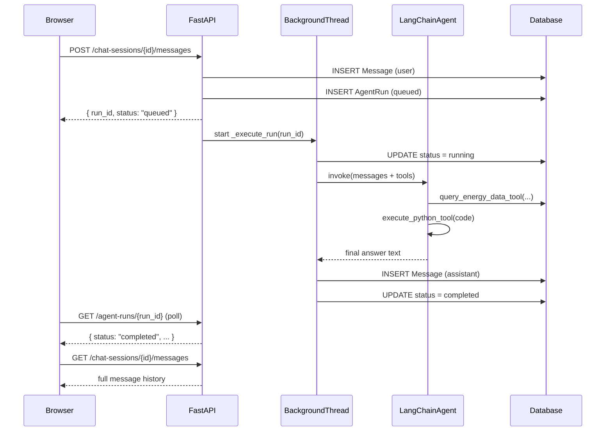

# Introduction

This open-source project serves as an opportunity for the author to test new agentic AI frameworks, specifically LangChain. The objective is to learn how to develop LangChain-based AI agents within a simulated enterprise environment working with structured databases.

As AI assistants become mainstream tools in enterprise software, one of the hardest architectural problems is not making the AI smart — it is making the AI *safe*. When multiple organisations share a single application, the AI must answer every user's questions accurately while being completely blind to data that belongs to other companies. One rogue query, one missing filter, and you have a serious data breach. At the same way, when serving different clients at the same time with the same platform, instead of re-inventing the wheel every time and coding the whole platform from scratch, it could be efficient to have a single platform working for different clients, or tenants, in the platform.

This project tackles that challenge head-on. I built a multi-tenant AI agent platform for solar plant analytics — a system where users from different companies can log in, chat with an AI assistant about their plant performance and financials, and receive downloadable reports, all without ever seeing data that belongs to another organisation.

The project was developed as a technical case study with an explicit focus on clarity and explainability. The goal was to demonstrate that the hard problems — tenancy isolation, role-based permissions, background execution, and document generation — can be solved cleanly without resorting to a massive production-scale architecture.

# Project Overview

The platform is a web application backed by a Python/FastAPI server. Users interact through a lightweight chat interface where they can ask questions like *"What was the total energy output for plant 1002 last month?"* or *"Generate a PDF report comparing our two plants."*

Behind the scenes, a LangChain AI agent receives the message and autonomously decides which tools to call — querying a database, running a Python calculation, or generating a document — before returning a coherent natural language answer. Every query the agent executes is automatically scoped to the requesting user's company. The agent never has unrestricted database access; it can only interact through approved, tenant-aware tools.

Two demo companies are pre-loaded, each with two plants, several users at different permission levels, time-series energy readings, and financial data including hourly market prices and monthly operational costs.

# Key Features

**Multi-tenancy by design.** Every database table that holds tenant data carries a `company_id` column. This is not just a convention — it is enforced in every single SQL query. Whether the agent is fetching a raw energy reading or an aggregated cost summary, the `WHERE company_id = :current_company` clause is always there. There is no code path that can skip it.
**Role-Based Access Control.** Users belong to one of two roles. Admins can access both operational (energy) and financial data. Operators can access operational data only. Financial endpoints check the user's `access_scope` attribute before executing any query and return HTTP 403 if the scope is insufficient. This check happens at the backend tool layer, not in the frontend, so it cannot be bypassed by a clever prompt or a modified browser request.

**Conversational AI with real tool use.** The agent is built using LangChain's ReAct (Reason + Act) loop. Rather than generating a static response, the model iterates: it reasons about what information it needs, calls a tool, reads the result, and decides what to do next. This means the agent can chain multiple steps — query energy data, run a Python calculation on the results, then write a summary — all in a single user turn.

**On-demand document generation.** When a user explicitly asks for a report, the agent calls a document generation tool that queries the database, performs statistical analysis, optionally prompts the LLM to write prose sections, and renders a properly formatted PDF, Word document, or Excel spreadsheet. Documents are stored on disk and linked back to the originating conversation so users can download them later.

**Background execution with status polling.** Agent runs are executed in a background thread. The HTTP response returns immediately with a `run_id`, and the frontend polls for status (`queued → running → completed / failed`). This means long-running multi-step agent tasks do not block the browser and users can even refresh the page and reconnect to an in-progress run.

# How It Works

The system has four logical layers that interact in a well-defined sequence every time a user sends a message.

**Authentication** is session-cookie based. On login the user selects a pre-seeded demo account; the server stores the `user_id` in a signed cookie. Every subsequent request calls `get_current_user()`, which reads the cookie and loads the user's `company_id` and `role` from the database. All authorization decisions flow from this single dependency.

**The agent tools** are inner functions (Python closures) defined fresh for each run, with the current user's context captured in the closure. This means the LLM cannot supply — or manipulate — the tenant identifier. It is simply invisible to the model.

**Code execution** is handled by a small restricted evaluator. The agent can ask it to run Python code for calculations or data summaries. The evaluator parses the code with Python's `ast` module, replaces the built-in namespace with an explicit whitelist, and intercepts `import` statements to allow only safe standard-library modules (`math`, `statistics`, `json`, `datetime`, etc.). It is not a full process-isolated sandbox, but it is sufficient for a controlled demo where the LLM itself generates the code.

# Results

The platform successfully demonstrates all of its stated goals. Two companies run side-by-side in the same SQLite database, and querying one company's data from the other's session correctly returns no results or raises a 403 error. Role-based checks work: an operator account correctly receives a permission error when asking for financial data.

The agent handles multi-step analytical requests end-to-end. A query like *"Sum the energy output for each plant and tell me which one performed better"* triggers a data query followed by a Python calculation, with the model synthesising the result into a coherent answer. Document generation produces well-structured PDFs and Word documents containing statistical tables and LLM-written analysis sections.

The fallback mode — which kicks in when no LLM API key is configured — confirms that the database, tenant isolation, and document pipeline all work correctly without a live model, which made iterative local development significantly faster.

# Lessons Learned

**Carry `company_id` everywhere, not just at the top.** Early in the design I considered looking up ownership through join paths (e.g. `DataPoint → DataSource → Plant → Company`). I abandoned this quickly: it adds query complexity and introduces subtle bugs when joins are missed. Storing `company_id` directly on every tenant-scoped table makes every query short and its safety immediately auditable.

**A single auth dependency is worth its weight.** Because every endpoint uses `Depends(get_current_user)` as the sole source of `company_id` and `role`, there is exactly one place to audit and one place to break. Any endpoint that accidentally skips the dependency becomes trivially obvious.

**Tool closures keep LLMs away from sensitive context.** Defining agent tools as closures over the current user's session means the LLM model never sees or handles tenant identifiers. The model reasons about *what* to query; the infrastructure silently ensures the query is properly scoped.

**Background threads need their own database sessions.** Passing a FastAPI request-scoped database session into a background thread causes subtle crashes and transaction conflicts. Every background worker must open its own `SessionLocal()` at the start and close it when done.

**Fallback modes accelerate development.** Having a deterministic fallback path that exercises the full pipeline without a live LLM let me test session management, RBAC, polling, and document generation in complete isolation from the model provider. This saved a significant amount of time and API cost during development.

# Future Improvements

- **PostgreSQL + Row-Level Security.** Migrating from SQLite to PostgreSQL would allow enforcing tenant isolation at the database engine level through RLS policies, providing a second line of defence independent of application code.
- **True code sandbox.** Replacing the whitelist-based Python evaluator with a proper process-isolated sandbox (e.g. a subprocess with a restricted OS profile) would make the code execution tool safe for production use.
- **Streaming responses.** LangChain supports token-level streaming. Adding a Server-Sent Events endpoint would let the frontend display the agent's reasoning in real time rather than waiting for the full run to complete.
- **Additional LLM providers.** OpenAI, Gemini, and OpenRouter are stubbed in `llm_factory.py`. Completing these integrations would give users flexibility in choosing their model provider.
- **Automated test suite.** The validation scripts in `scripts/` are useful for manual checks, but a proper `pytest` suite with fixtures for seeded tenants would make the codebase much safer to extend.
- **User management UI.** Currently users are fixed at ingestion time. A simple admin interface for adding users and adjusting roles would make the demo more realistic.

# Repository

Full code, case study data, and detailed documentation available on GitHub.
Check out the [GitHub repository](https://github.com/andreabragantini/multi-tenant-agent-plant-data) for more details and to contribute to the project!